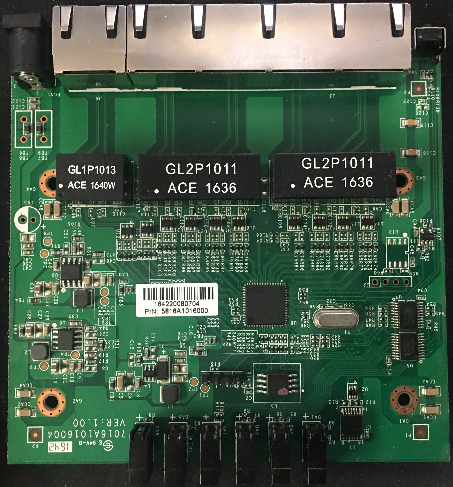
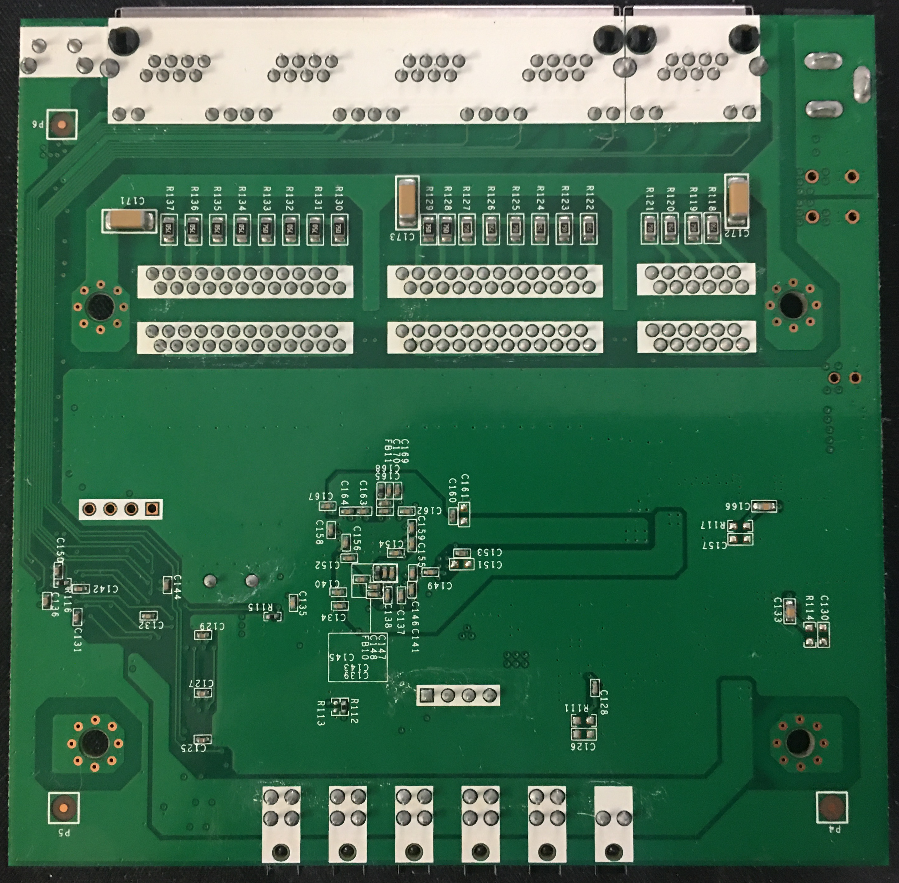
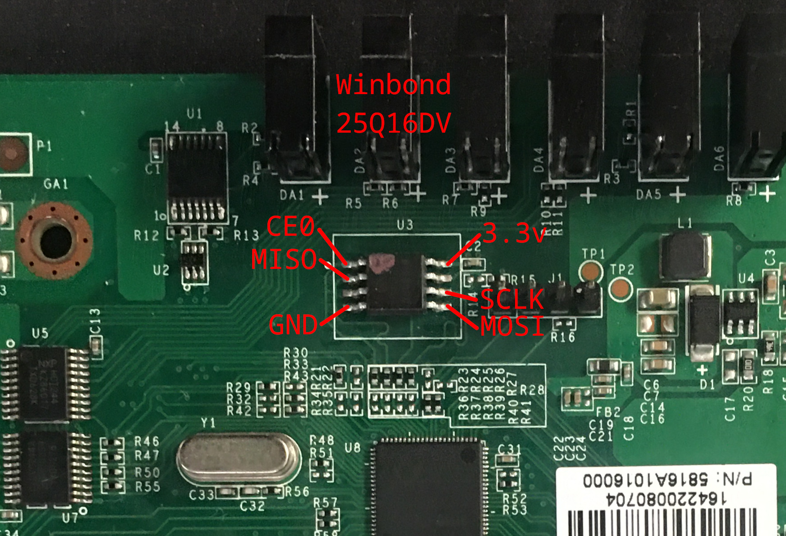

# Reflashing an Araknis 5 Port Gigabit Switch (AN-110-SW-C-5) as a Netgear GS105E v2

|  |  |

The Araknis AN-110-SW-C-5 is a 5 port Unmanaged+ gigabit network switch based on the RTL8367N switch controller. It supports Snap One's OvrC (oversee) cloud remote management solution. As is, the firmware is pretty bear-bones, including only some basic status information and an option to disable OvrC.

When I commandeered this switch out of the trash pile from a restaurant remodel I was pretty disappointed to learn that while it does have a web interface, it does not support any useful features that even the most basic of managed switch would support. However, after opening it up and researching the RTL8367N switch controller I found [this article](https://github.com/libc0607/Realtek_switch_hacking/blob/master/RTL8367N-GS105Ev2.md) by libc0607 describing the process for flashing a different switch with the same Realtek chip using firmware for a Netgear GS105E v2 (which also uses the RTL8367N). 

The article describes how to make some hardware modifications to their switch, however in my case I did not have to change any hardware to make Netgear's firmware function on the Araknis switch. 

## Known Issues
After flashing almost all of the functions of the switch seem to work perfectly. All of the LEDs work and correspond with the correct switch port and the switch can do full gigabit speed (via iperf).

**However**, the reset button does not seem to work, so make sure you don’t forget your password. This likely requires a hardware mod to fix.

I also encountered a weird glitch, if power saving is disabled when switch port 1 is connected, port 1 will stop working. Unless you disable power saving when it is disconnected, then once its disabled everything seems to work fine again.

There are no guarantees about the functionality of the switch, see the [disclaimer](#disclaimer) at the bottom of this page.

## Preparing the New Firmware

Download the full flash dump `gs105e_v2_fullflash_dcef09e1aed8.bin` from [libc0607's Realtek_switch_hacking repository](https://github.com/libc0607/Realtek_switch_hacking/blob/master/gs105e_v2_fullflash_dcef09e1aed8.bin). This contains the bootloader, kernel, software, and configuration for a Netgear switch.

Before we flash the firmware, we have to make some modifications.

### Padding the Firmware

We need to pad the firmware to match the flash chip size so flashrom doesn't complain.

1. Create a new file containing `0xFF`'s to the size of the flash chip.
	```
	$ head -c 2097152 /dev/zero | LC_ALL=C tr "\000" "\377" > gs105e_v2.bin
	```
2. Insert the flash dump into the padded file.
	```
	$ dd if=gs105e_v2_fullflash_dcef09e1aed8.bin of=gs105e_v2.bin conv=notrunc
	```

### Fixing the MAC Address

The MAC address of the switch is stored in the flash chip, we are overwriting the entire flash chip, so we will have to add it to the new firmware image.

1. Open `gs105e_v2.bin` in your favorite hex editor (such as GHex).
2. Jump to the offset `0xFC000`.
3. Enter the MAC address of the switch (probably located on the sticker on the bottom of the device), and terminate it with a `0x00` byte. Note: do not enter the colon ":" separators. You are entering it as literal hex values (6 bytes + 1 for termination), not ascii.
	With a MAC address of `11:22:33:AA:BB:CC` it should read as:
	```
	... FF FF FF FF 11 22 33 44 AA BB CC FF FF FF FF ...
	                ^
	                Offset: 0xFC000
	```
4. Perform step 3 again, but for the offset `0x1FC000`.

## Flashing the Switch

Unfortunately, the firmware upgrade utility in the web interface does not seem to accept Netgear firmware files, so unless someone wants to figure out the secret sauce for that, we are stuck writing to the flash chip directly.

 1. Grab your favorite SPI flash chip reader, or a Raspberry Pi and hook it up to the flash chip as shown below. It is easier to use an SOIC8/16 chip clip, but you can solder directly to the chip. You are not required to desolder the chip from the board before flashing. Also ensure your flashing tool supports 3.3 volt flash chips.
	Also verify that the flash chip is 16Mbit (2Mbyte), such as the Winbond W25Q16DV.

	
 
 2. Boot up your Pi and ensure you have flashrom installed.
	 ```
	 # apt update && apt install flashrom
	 ```

3. Optionally (**but highly recommended**) make a backup of the original firmware.
	```
	# flashrom -p linux_spi:dev=/dev/spidev0.0,spispeed=1024 -r an-110-sw-c-5-original.bin
	```
	Additionally, read the flash chip 2 or 3 more times and make sure the hashes match to ensure your setup is reliable.
	```
	# flashrom -p linux_spi:dev=/dev/spidev0.0,spispeed=1024 -r an-110-sw-c-5-original-1.bin
	# flashrom -p linux_spi:dev=/dev/spidev0.0,spispeed=1024 -r an-110-sw-c-5-original-2.bin
	# flashrom -p linux_spi:dev=/dev/spidev0.0,spispeed=1024 -r an-110-sw-c-5-original-3.bin
	...
	# sha256sum an-110-sw-c-5-original.bin*
	```
	As one more check, `hexdump` one of the files and make sure its not all `00` or `FF`, if it is you have a bad connection.
	
4.  Now flash the firmware file you prepared above.
	```
	# flashrom -p linux_spi:dev=/dev/spidev0.0,spispeed=1024 -w gs105e_v2.bin
	```
5. If everything completed successfully you can disconnect from the flash chip and power up the switch. The firmware will try to get an IP address from a DHCP server. 

## Update to the Latest Firmware

1. Go to Netgear's product page for the GS105E v2 and download the latest firmware image.
2. Open your newly flashed switch's web interface and locate the Firmware Update page (System>Maintenance>Firmware Update).
3. Enter loader mode and upload the new firmware image.
4. Your switch should now be on the latest Netgear firmware.

## Disclaimer

The content provided here is for informational and educational purposes only. It describes procedures that may involve modifying hardware or software in unsupported ways.

**You assume all responsibility and risk** associated with using this information. The author makes no guarantees about the accuracy, completeness, or safety of these instructions.

Performing firmware modifications can permanently damage your device, void warranties, disrupt network functionality, or violate legal or licensing agreements.

This content references third-party firmware made available by another GitHub user. **Use of such firmware is entirely at your own risk.** You are responsible for reviewing and complying with any license, usage terms, or conditions set by the provider and original author of that firmware.

**The author is not liable** for any loss, damage, or consequences — direct or indirect — resulting from the use, misuse, or inability to use any part of this information.
